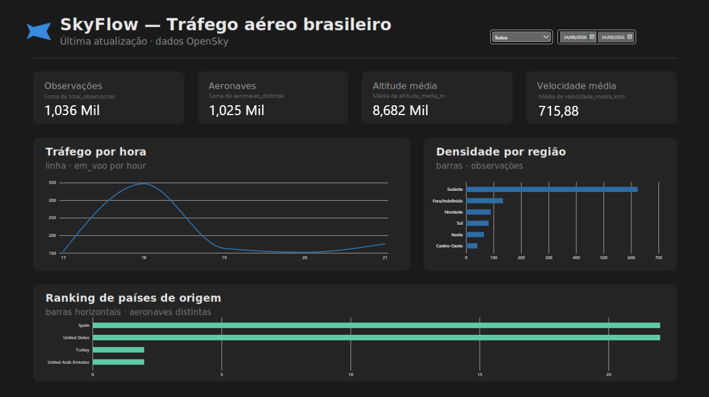

# SkyFlow 

Pipeline de dados de tráfego aéreo brasileiro — **100% gratuito**, agendado, com
arquitetura em camadas (bronze/silver/gold), modelagem dimensional, testes de
qualidade e relatório em Power BI.

Coleta posições de aeronaves sobre o Brasil de hora em hora a partir da rede
[OpenSky Network](https://opensky-network.org/), transforma os dados com DuckDB
e serve um dashboard analítico.



---

## O que este projeto demonstra

- **Ingestão automatizada** de uma API real (OAuth2, rate limiting, backoff) via GitHub Actions, sem servidor e sem custo.
- **Arquitetura medalhão** (bronze → silver → gold) com transformações versionadas em SQL.
- **Modelagem dimensional** (star schema) com tabelas-dimensão e propagação de filtro.
- **Qualidade de dados** com validações automatizadas.
- **Visualização** em Power BI conectada às camadas analíticas.

---

## Arquitetura

| Camada | Ferramenta | Papel |
|---|---|---|
| Agendamento | GitHub Actions (cron) | Dispara a coleta de hora em hora, sem servidor |
| Ingestão | Python + `requests` | Autentica (OAuth2) e coleta o snapshot do Brasil |
| Armazenamento | Parquet particionado | Dados versionados, particionados por data/hora |
| Transformação | DuckDB (SQL) | Bronze → Silver → Gold |
| Modelagem | Star schema | Dimensões de data e região ligadas às fatos |
| Qualidade | Great Expectations | Valida schema, nulos e ranges por camada |
| Dashboard | Power BI Desktop | Relatório do tráfego (refresh manual sobre o gold) |

**Fluxo:** Actions (de hora em hora) → coletor Python → grava **bronze** em Parquet →
DuckDB transforma em **silver** (limpa) e **gold** (marts + dimensões) → Power BI consome.

---

## Modelo de dados

### Camadas

- **Bronze** — resposta crua da OpenSky, append-only, particionada por `ingest_date/hour`. Fonte da verdade, reprocessável.
- **Silver** — dados limpos: descarte de registros sem posição, correção de `on_ground` nulo (aeronaves em solo mal classificadas), conversão de unidades, dedup, e derivação da macrorregião.
- **Gold** — star schema: três tabelas de fato (tráfego por hora, densidade por região, ranking de países) e duas dimensões (`dim_data`, `dim_regiao`) que alimentam os filtros do dashboard.

### Star schema

As dimensões `dim_data` e `dim_regiao` ligam-se às três fatos por `ingest_date` e
`regiao_aprox` (relacionamento 1:N). Um slicer sobre a dimensão filtra todos os
visuais de uma vez — o comportamento correto de um modelo dimensional.

---

## Como rodar

```bash
# 1. Ambiente
python -m venv .venv
source .venv/bin/activate          # Windows: .venv\Scripts\activate
pip install -r requirements.txt

# 2. Credenciais da OpenSky (Account -> API client -> credentials.json)
#    Coloque credentials.json na raiz, OU exporte:
export OPENSKY_CLIENT_ID=seu_id
export OPENSKY_CLIENT_SECRET=seu_secret

# 3. Coletar um snapshot (grava a bronze)
python src/collect.py

# 4. Transformar bronze -> silver -> gold
python src/run_transform.py

# 5. Inspecionar os resultados
python src/inspect_bronze.py
python src/inspect_gold.py
```

Para conectar o Power BI: `Get Data → Blank query` e use
`Parquet.Document(File.Contents("...\data\gold\<arquivo>.parquet"))` para cada mart
e dimensão. Aplique o tema em `powerbi/skyflow-theme.json`.

> **Segurança:** `credentials.json`, `.env` e chaves estão no `.gitignore`.
> No GitHub Actions, as credenciais vêm dos **Secrets** do repositório.

---

## Automação

O workflow em `.github/workflows/collect.yml` roda de hora em hora, coleta um
snapshot e commita a bronze de volta ao repositório. Credenciais ficam em GitHub
Secrets (`OPENSKY_CLIENT_ID`, `OPENSKY_CLIENT_SECRET`), nunca no código.

---

## Decisões de arquitetura e trade-offs

Decisões conscientes, documentadas para transparência:

- **Dados versionados no Git** é um antipadrão em produção (o histórico incha), mas
  aceitável aqui: volume pequeno, custo zero, reprodutível por quem clonar. Em
  produção: object storage (S3/R2), com o Git guardando apenas o código.

- **Região por bounding box** — a OpenSky fornece lat/lon e o país de registro da
  aeronave, não a UF sobrevoada. A macrorregião é derivada por caixas retangulares
  aproximadas de lat/lon. Serve para visão macro, não precisão cartográfica; as
  caixas se sobrepõem nas fronteiras (daí a categoria "Fora/Indefinido"). Em
  produção: malhas geográficas do IBGE (GeoJSON) com join espacial (`ST_Contains`).

- **Micro-batch, não streaming** — a cota da OpenSky (~4.000 chamadas/dia) limita a
  coleta a ~1 a cada 20–30s. O projeto assume isso honestamente: é um pipeline de
  micro-batch de hora em hora, não streaming sub-segundo.

- **Kinesis/Kafka trocados por GitHub Actions** — para custo zero. O conceito de
  ingestão agendada e desacoplada permanece.

---

## Estrutura do repositório

```
skyflow/
├── src/
│   ├── collect.py          # coletor da bronze (produção)
│   ├── run_transform.py    # runner das transformações DuckDB
│   ├── inspect_bronze.py   # inspeção da bronze
│   ├── inspect_gold.py     # inspeção da gold
│   └── opensky_probe.py    # sonda de validação da API
├── sql/
│   ├── silver.sql          # bronze -> silver (limpeza)
│   └── gold.sql            # silver -> gold (star schema)
├── data/
│   ├── bronze/             # Parquet cru, particionado
│   ├── silver/             # dados limpos
│   └── gold/               # fatos + dimensões
├── powerbi/
│   ├── skyflow-theme.json  # tema do Power BI
│   └── background.svg      # fundo do dashboard
├── .github/workflows/
│   └── collect.yml         # coleta agendada
├── docs/
├── requirements.txt
└── .gitignore
```

---

## Stack

`Python` · `DuckDB` · `Parquet` · `SQL` · `GitHub Actions` · `Power BI` ·
`Great Expectations` · `OAuth2` · arquitetura medalhão · modelagem dimensional